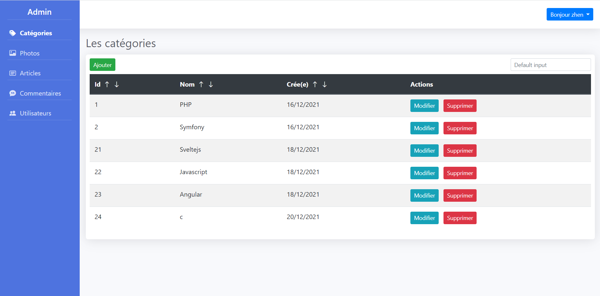

# php_mvc_javascript 
# admin

C'est un petit projet créé en PHP  en appliquant la structure MVC(model, vue, controller)
<ul>
    <li>blog en front(sveltejs) : https://github.com/Heroszhen/php_mvc_javascript_blog_front</li>
    <li>
        
email: exemple@gmail.com

        
mot de passe: aaaaaaaa

    </li>
    <li>Template : html</li>
    <li>Javascript natif</li>
    <li>Router : nikic/fast-route</li>
    <li>Serveur : php -S localhost:8000</li>
    <li>phpunit</li>
    <li>phpmailer : gmail</li>
</ul>

    

